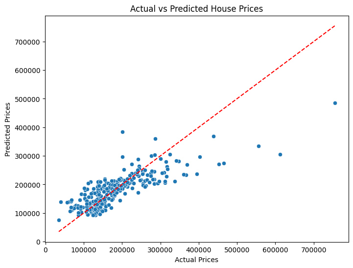

# 🏠 House Price Prediction

This project predicts house prices using machine learning regression techniques on Kaggle’s housing dataset.

## 📂 Files Included
- `House-Price-Prediction.ipynb` – Jupyter Notebook with full analysis and model
- `train.csv` / `test.csv` – Training and testing datasets
- `data_description.txt` – Feature descriptions
- `Output.png` – Output: Actual vs Predicted prices plot

## 📊 Output Plot

## 🚀 How to Run
1. Open the notebook in Jupyter
2. Install required packages
3. Run all cells

## ✅ Model Used
- Linear Regression
- Ridge / Lasso
- Random Forest (optional)

## 📌 Dataset
From Kaggle: [House Prices - Advanced Regression Techniques](https://www.kaggle.com/competitions/house-prices-advanced-regression-techniques)

